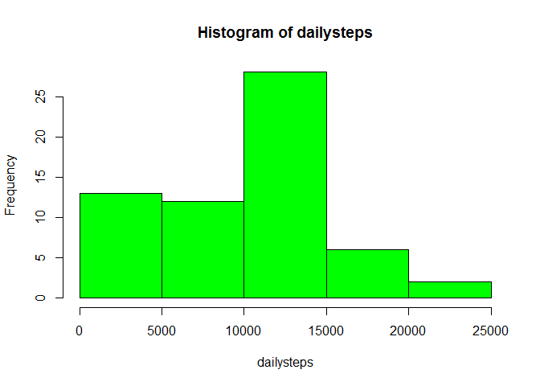
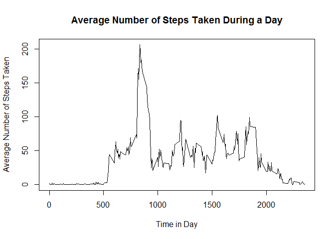
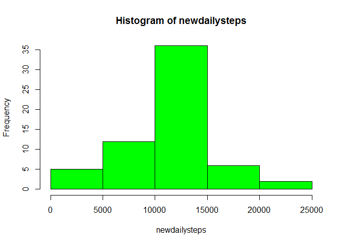
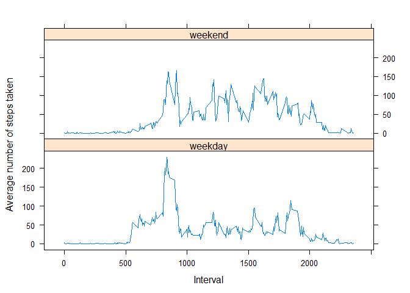

# Reproducible Research: Peer Assessment 1

## Introduction

This is an assignment done for Peer Assessment 1 project in the coursera course *Reproducible Research* offered by the Johns Hopkins University. The data for this assignment comes from a personal activity monitoring device. This device collects data at 5 minute intervals throughout the day. The data consists of two months of data from an anonymous individual collected during the months of October and November, 2012 and include the number of steps taken in 5 minute intervals each day.

This dataset has a total of 17,568 observations, and the variables included are:

- **steps:** Number of steps taking in a 5-minute interval (missing values are coded as NA)

- **date:** The date on which the measurement was taken in YYYY-MM-DD format

- **interval:** Identifier for the 5-minute interval in which measurement was taken

## Loading and preprocessing the data

First we need to load the data. The data is ready to use, and I don't think there is any preprocessing needed.


```r
act<-read.csv("activity.csv")
```

## What is mean total number of steps taken per day?

For this part of the assignment, I am allowed to ignore the missing values in the dataset.

1. First I am asked to calculate the total number of steps taken per day.

```r
dailysteps<-tapply(act$steps,act$date,sum,na.rm=TRUE)
```
Here I use `na.rm=TRUE`, so I ignore the missing values. Notice that `act$date` is already a factor variable, and I don't have to convert it to `Date` class.

2. Second I am asked to make a histogram of the total number of steps taken each day. You can see from the histogram that there are many days (more than ten) with zero or small total number of steps taken (less than or equal to 5000). It is possibly due to ignoring the missing values, because days with all missing values in the number of steps taken will have zeros as totals, and days with some but not all missing values will have small numbers as totals.


```r
hist(dailysteps,col="green")
```

 

3. Then I am asked to calculate and report the mean and median of the total number of steps taken per day


```r
mean<-mean(dailysteps)
mean
```

```
## [1] 9354.23
```

```r
median<-median(dailysteps)
median
```

```
## [1] 10395
```

Thus the mean and median of the total number of steps taken per day are 9354.23 and 10395 respectively.
    
## What is the average daily activity pattern?

For this part of the assignment, I assume that I am still allowed to ignore the missing values in the dataset, because imputing missing values is the next part of this assignment. In fact, one can find out that all days in this dataset have either all missing values or all non-missing values for number of steps taken in the 5-minute intervals, so it will not impact the result of this part even after imputting the missing values by the means for the corresponding 5-minute intervals.

1. First I am asked to make a time series plot of the 5-minute interval (x-axis) and the average number of steps taken, averaged across all days (y-axis). So in the first place I need to calculate the average number of steps taken at each 5-minute interval across all days.


```r
tssteps<-tapply(act$steps,act$interval,mean,na.rm=TRUE)
```

To make the time series plot, I also need to get the x-axis labels.
    

```r
interval<-dimnames(tssteps)[[1]]
```

Now make the time series plot. It shows the average daily activity pattern.
    

```r
plot(interval,tssteps,type="l",xlab="Time in Day",ylab="Average Number of Steps Taken",main="Average Number of Steps Taken During a Day")
```

 

2. Now I am asked to find the 5-minute interval which contains the maximum number of steps, on average across all the days in the dataset.


```r
maximalow<-as.integer(names(which(tssteps==max(tssteps))))
maximalow
```

```
## [1] 835
```

```r
maximaup<-maximalow+5
maximaup
```

```
## [1] 840
```

Thus the 5-minute interval requested is from 835 to 840. It should be in the morning, as the dataset is using the 24-hour format for the time in intervals.

## Imputing missing values

As the presence of missing days may introduce bias into some calculations or summaries of the data, we need some way to handle the missing values.

1. First let's calculate and report the total number of missing values in the dataset


```r
sum(is.na(act$date))
```

```
## [1] 0
```

```r
sum(is.na(act$interval))
```

```
## [1] 0
```

```r
numna<-sum(is.na(act$steps))
numna
```

```
## [1] 2304
```

We can see that there is no missing values for the variables `date` and `interval`, and we have 2304 missing values for the variable `steps`.
    
2. To fill in all of the missing values for the variable `steps` in the dataset, I am going to use the mean of the non-missing values with the corresponding 5-minute intervals. I also need to create a new dataset to contain the imputted values.


```r
newact<-data.frame(interval=as.integer(interval),tssteps)
newact<-merge(act,newact,all.x=TRUE)
naind<-is.na(newact$steps)
newact$steps[naind]<-newact$tssteps[naind]
```

3. Now I need to make the new dataset equal to the original dataset, except with the missing data filled in. I also want to arrange it to make it look nice.


```r
newact$tssteps<-NULL
newact<-newact[,c(2,3,1)]
newact<-newact[order(newact$date,newact$interval),]
rownames(newact)<-1:dim(newact)[1]
```

4. Then I am asked to make a histogram of the total number of steps taken each day. This time I don't need to use `na.rm=TRUE`, because there is no missing values.


```r
newdailysteps<-tapply(newact$steps,newact$date,sum)
hist(newdailysteps,col="green")
```

 

You can see from the histogram that there are less days (five now) with zero or small total number of steps taken (less than or equal to 5000), comparing with the histogram from the first part of the assignment.

Next I need to calculate and report the mean and median total number of steps taken per day.


```r
options(scipen=1)
newmean<-mean(newdailysteps)
newmean
```

```
## [1] 10766.19
```

```r
newmedian<-median(newdailysteps)
newmedian
```

```
## [1] 10766.19
```

The new mean and median of the total number of steps taken per day after imputting are 10766.19 and 10766.19 respectively, which differ from the estimates from the first part of the assignment. So imputing missing data will change the estimates of the total daily number of steps. In fact it will make them larger when changed, because days previously with all missing values will now have positive totals instead of zero, and days previously with some but not all missing values will have larger totals.

## Are there differences in activity patterns between weekdays and weekends?

I am asked to use the dataset with the filled-in missing values for this part.

1. First I need create a new factor variable in the dataset with two levels - "weekday" and "weekend" indicating whether a given date is a weekday or weekend day.


```r
weekday<-weekdays(as.Date(newact$date,"%Y-%m-%d"))
newact$weekday<-factor(ifelse(weekday=="Saturday"|weekday=="Sunday","weekend","weekday"))
table(newact$weekday)
```

```
## 
## weekday weekend 
##   12960    4608
```

2. Next I need to make a panel plot containing a time series plot of the 5-minute interval (x-axis) and the average number of steps taken, averaged across all weekday days or weekend days (y-axis). Thus in the first place, I need get the average number of steps taken, averaged across all weekday days or weekend days, for each 5-minute interval.


```r
tssteps<-tapply(newact$steps,interaction(newact$interval,newact$weekday),mean)
```

As before, I need to get the x-axis labels next.


```r
fac<-dimnames(tssteps)[[1]]
facsplit<-strsplit(fac,"\\.")
interval<-sapply(facsplit,function(x){x[1]})
weekday<-sapply(facsplit,function(x){x[2]})
```

I am going to make the panel plot by using the lattice plotting system, thus I need to collect the relevant variables together into a data frame for my convenience.


```r
paneldat<-data.frame(tssteps,Interval=as.integer(interval),weekday)
```

Now I make the requested panel plot. One can see that the activity patterns between weekdays and weekends are different.


```r
library(lattice)
xyplot(tssteps~Interval|weekday,data=paneldat,type="l",layout=c(1,2),ylab="Average number of steps taken")
```

 
